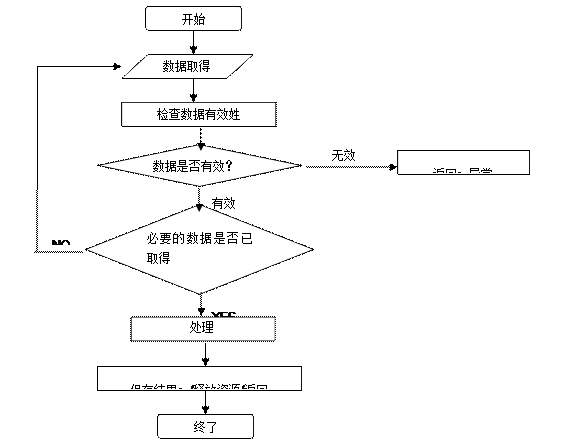

# JAVA 编码规范(BETA)

[TOC]


## 目的

 本文天职信息技术适用于Java的的编码规范文件，目的是统一编码风格、提高代码质量。

## 范围

本文的适用范围是项目的编码阶段，同时也适用于项目的设计阶段和测试阶段。本文的适用项目是使用Java语言开发的项目。

本文适用于掌握Java语言开发的开发人员。

## 前提条件

本文的第一条规则是任何规则都有例外。如果在编码中有违反本文规则的地方，请加上注释。

本文中的一些约定对您现在的编码习惯可能并没有绝对的好处，它们仅仅为了统一代码风格。

## Java编码规范概要

Java代码风格概要说明如下。

### 代码风格

#### 一般格式说明

- 除字符串和注释内以外， 代码中的空格一律为半角。

- 代码中不应有[TAB]字符（除字符串内），需要[TAB]字符的地方一律替换成4个空格。

- 代码中换行和DOS系统相同，为/r/n。

- 代码应该有缩进， 缩进为4个空格。

- 缺省的一行代码最大长度为80个半角字符，如果超过这个长度就需要换行。一般的情况下，换行后应缩进四格。

- 任何可以省略大括号的地方都不应省略大括号。


####基本结构

一个类/接口的基本结构应该是这样的。

``` java
变更履历            
Package声明         
Import声明          
Class Header        
常量（Menifest Variables）   
成员变量（Instance Variables）  
构造器（Constructors）     
属性（Properties）       
方法（Public Methods）     
方法（Protected Methods）   
方法（Friendly Methods）    
方法（Private Methods）    
内部类（Inner Class）      
测试方法（Test Main）      
初始Block（Initializer Blocks）
```


以下依次说明。

### 代码结构

#### 变更历史

范例

``` java
/**
* MyClass.java
*
* 功  能： （用一句话描述类的功能）
* 类名： MyClass
*
*   ver     变更日      部课    担当者     变更内容
* ──────────────────────────────────
*   V1.00   '02-06-27    Tzecc  王大牛     初版
*   V1.01   '02-09-20    Tzecc  王大牛     改订
*   V1.10   '03-02-04    Tzecc  王大牛     改订
*
* Copyright (c) 2002, 2003 Tzecc Business Software corporation All Rights Reserved.
* LICENSE INFORMATION
*/ 
```

**说明**:
-  “文件”的第一行是正文，在它前面没有NULL行。

-  当客户要求代码规约的时候， 使用上述模版。 其中需要修改的部分已经用**粗体**标出。

-  在“变更履历”中有一部分是版本编号（ver），具体的编号方法依从项目制定的版本变更策略。

-  在“变更履历”的版权信息中，有关于年份的描述。其中“2002”是指这个类第一次发行的年份；“2003”是指这个类最后一次发行的年份。

-  在“变更履历”的版权信息中，有关于版权所有者的描述。其中的“Neusoft Business Software”，根据不同的项目，可以修改成TOSHIBA等字样。

-  如果项目中有相关的许可信息（license），这些信息可以在“LINCENSEINFORMATION”处加入。

-  如果项目中，变更履历使用CVS等源码管理系统维护，那么此“变更履历” 可以精简为

``` java
/**
* $Header : /xxx/xxx/xxx.java $
* $Revision : 1.4.1 $
* $Date : 2003/08/20 02:23:08 $
*
* Copyright (c) 2002, 2003 Neusoft corporation All Rights Reserved.
* LICENSE INFORMATION
*/
```


#### Package声明

范例

``` java
package com.neusoft.myapp.mypack;
```

说明

- 在客户没有明确指定package的条件下，package遵循以下命名规则：

 1. package名全部为小写字母，中间用“.”分割。
 2. package名中禁止使用除小写英语句半角字母以外的任何字符，但是根据需要可以使用下划线`_`。 例如`package com.neusoft.my_app.mypack;`

 3. 标准的package名可以分为三部分：<公司名>.<应用程序名>.<包名>。其中“公司名”部分可以是“公司名称 + 部门名称”。例如`package com.neusoft.tos.myapp.mypack;`根据需要“公司名”部分也可省略。其中“应用程序名”部分可以是“应用程序名称 + 子程序名称”。例如`package com.neusoft.myapp.subapp.mypack;`

一般来说，“应用程序名”部分不能省略。其中“包名”部分应该根据程序设计的包结构来定义；“包名”这部分可以根据需要省略。

- 通常，“Package声明”部分不能省略。如果是应用程序比较简单，可以简化package的名称。例如，简单的试验使用的类，可以命名为“myapp.test”或者“test”；如果是一个小程序，可以命名为“myapp”或者“main”。
- 规定在每个package的目录下（前提是这个package中有class文件）， 都必须有一个package.html文件。 使用这个文件来描述这个package的信息。


####  Import声明

范例
``` java
import java.util.HashMap;
import java.util.Map;
import javax.servlet.http.HttpServletRequest;
import javax.servlet.http.HttpServletResponse;
import org.apache.log4j.Appender;
import org.apache.log4j.Category;
import com.neusoft.myapp.thatpack;
```

 **说明**

- `Import声明`内部没有NULL行。

- `Import声明`的次序是`java.* -> javax.* -> 中间件、库等提供的package -> 程序中的package`

- Import需要指出import哪一个类，禁止import整个package。 例如
```java
import java.util.*; //错误
import java.util.HashMap; //正确
```

- 通常程序内部用到的package都是用import语句声明在程序头部；原则上，程序内部不再出现没有import声明的类。例如
```java
java.io.File file = new java.io.File(“test.txt”); //错误
File file = new File(“test.txt”); //正确
```
但是会混淆的声明应该在程序中特别指出是那一个package中的。例如：

``` java
import java.util.Date;
import java.sql.Date;
…
java.util.Date date = new java.util.Date();

```

- 程序中用到的类应该在Import中声明，但是程序中没有用到的类不要出现在Import中。 例如
``` java
import java.util.HashMap;   -> 删除
…
（程序中未使用HashMap这样的类）
```

 

#### ClassHeader

范例

``` java
/**
* (这里用一句话描述这是一个什么样的类，格式：本类是XXXXXX。)
* (这里用1~5句话描述这个类的功能是什么。 - 可选)
* (这里介绍这个类涉及到的相关信息。 譬如，专有名词、概念的简单解释。 - 可选)
* (这里介绍这个类在系统中的角色， 以及如何和其他类交互。 - 可选)
* (这里介绍这个类的WHY，即为什么会存在这样一个类。 - 可选)
* (这里介绍这个类的使用方法。 - 可选)
* (这里是使用这个类的sample。 - 可选)
* (这里是使用这个类的注意事项。 - 可选) 
*
* @author   王大牛
* @version  Ver 1.2 2003-02-28 改订
* @since    CodingExample Ver 1.1
*
* @see YourClass, HisClass
* @deprecated （这里写deprecated的信息）
*/
```

说明

- `Class Header`可以分为3部分——说明部分、版本信息和其他信息，中间使用NULL行分割。

- 程序中的每一个类都必须有Class注释。根据需要，Class注释中除了说明部分不能省略外，版本信息和其他信息都可以省略。

- Class注释中的说明部分的写法参考范例，根据需要，可以省略其中的一些说明部分（可省略的部分后标有可选）。

- Class注释的版本信息中，除@since可以根据需要省略外，其他的都不可省略。

- Class注释的版本信息要上下对齐。

``` java
* @author   王・大牛
* @version  Ver 1.2 2003-02-28 改订
* @since    CodingExample Ver 1.1

```
- `@version`信息的结构是 `Ver<版本> <日期> <状态>`。 其中“版本”是项目版本，具体依据项目制定的版本变更规范；其中“日期”为此文件最后一次修改的日期；其中状态有两种选择“新规做成”和“改订”。
- `@since`信息的结构是“<项目名称> Ver <版本>”。 其中“项目名称”可以是项目的全称也可以是项目的简称，但是要注意在整个项目中这个名称应该不变；其中“版本”是这个类第一次被创建时的项目版本，具体依据项目制定的版本变更规范。
- Class注释的其他信息中，`@see`和`@deprecated`都可以省略。
- `@deprecated`的说明信息的结构是“<在哪个版本中不推荐使用> <使用哪个类替代>”。例如


``` java
* @deprecated CodingExample 1.2中，不推荐此Class。此Class的功能，被替换为com.neusoft.myapp.AnotherClass Class了。
* @deprecated CodingExample 1.2中，不推荐此Class。没有替补。
```


根据需要，选择上面两种表述方法中的一种，替换划线部分，做成需要的`@deprecated`信息。

 

#### Class

范例
``` java
public class MyClass extends SuperClass throws Exception {

    //do sth. (Class Body)

} ///:~
```

**说明**

- Class Body应该缩进4格。

- Class的最后一行规定以`}///:~`结尾。 这样做有以下好处。

 1. 标明到了文件最后一行。

 2. 防止不小心删除最后一个字符（大括号）。

 3. 有些编辑器可以去除每行后的空格，但是也有可能把这个大括号删除了。以这样结尾，可以防止这一点。

- Class声明部分可以分为4部分——Class前缀、Class名、扩展信息和例外信息。

- Class声明的结构是`[public/protected/private][final/abstract/static/strictfp] class/interface<类名> [extends …] [implements …] [throws …]`。

 1. 关于public/protected/private，在一般情况下（指Top-Level Class）， 规定所有的类都应该显式声明为public。

 2. 关于final，如果项目中没有显式地强调安全性，规定禁止将一个类声明为final。

 3. 关于abstract，如果一个类可以声明成interface，规定禁止把类声明为abstract；如果一个类中没有abstract的方法，规定禁止把类声明为abstract。

 4. 不能继承声明为static的类。

 5. 如果项目中不涉及到严格的数据运算（譬如，强调float和double的运算），那么禁止把类声明为strictfp。

- Class的命名遵循以下规则。

 1. Class的名称应该是一个名词短语。 可以是“形容词/名词 + 名词”的形式。 例如`InputDataStream`、`Developer`、`OrderItem`等。

 2. Class的名称由1个或1个以上的英语句单词组成， 其中每一个英语句单词的首字母应该大写， 其余字母小写。

 3. 规定Class名称只能由26个英文字母组成。

 4. Class命名应该具有一致性。 （一致性是指，如果在设计阶段确定了一个实体，那么和这个实体相关的Class应该具有一致的名称。 举例来说，“用户”这个实体可以被称作User、Account或者Person。如果决定使用User来表示这个实体的话， 则相应的Class名应该是UserFile和UserFileParser等， 避免在系统中出现既有UserFile又有AccountFileParser的情况。）

 5. 表示复数的Class可以命名为“单数+s”的形式。 例如，User和Users、Action和Actions、Mapping和Mappings等。

 6. Interface的名称可以是一个名词或者是一个形容词。 例如IService和IRunnable。

 7. 规定Interface名称只能由26个英文字母组成。

 8. Interface的名称由1个或1个以上的英语句单词组成， 其中每一个英语句单词的首字母应该大写， 其余字母小写；规定Interface的名称前应该有一个“I”。

 9. 实现Interface的类一般地应该加上后缀“Imp”。 例如，接口IListener对应MyListenerImp。

- 关于Class声明部分的缩进，可以在如下形式中选择一种。

​   

``` java
public class MyClass extends YourClass implements TheirClass 
throws OurException 
{
public class MyClass extends YourClass throws OurException,
TheirException,
AnotherException 
{
public class MyClass extends YourClass implements whichIF,
whatIF,
whereIF
{
public class MyClass extends YourClass implements whichIF,
```

 

#### 常量（Menifest Variables）

范例

``` java
/**
* （用一句话描述这个变量表示什么）
*
* @since CodingExample Ver 1.1
*/
public static final int MAX_LENTH = 25;

```

**说明** 

- 类中常量的声明位于类的最前面， 和类的声明之间NULL一行。

- 在声明常量的时候给它付值。

- 定常量应该被修饰为public、static和final；一般地，把public改成protected和private没有特别大的意义。

- 常量的名称使用26个英语句大写字母和下划线“_”组成。

- 如无设计上的必要，规定把常量写在class中代替把常量写在interface中。


#### 成员变量（Instance Variables）

范例

``` java
/**
* （用一句话描述这个变量表示什么）
*
* @since CodingExample Ver 1.0
*/
private String _name = null;

```

说明

- 在声明变量时应该给它付值。却省对象付值为null；整型、长型、浮点型等为0；布尔型为false。

- 一般地，类成员变量声明为private。如果需要访问，则提供相应的getter和setter方法。原则上不通过instance._variable的方式访问。如果设计上无继承扩展的考虑，则不应声明为protected。规定类成员变量不声明为friendly。

- 类成员变量的名称使用26个英文字母并且规定使用下划线“_”开头。

- 类成员变量是否为static应该在设计时决定。一般地，不要把类成员变量声明为final（即，如果声明为final，那么必须声明static，作为常量使用）。


#### 初始块（Initializer Blocks）

范例

``` java
/**
* （这里描述这部分代码的作用）
*
* @since CodingExample Ver 1.0
*/
static {
	//本体处理
}
```

说明


- 是否使用static block应该在设计时决定。

- 原则上，在声明类成员变量的时候同时进行初始化。 如非必要，不应把声明时的初始化工作在static block中做。例如

``` java
private String _name;
static {
  _name = “Default Name”;　//错误
}
private String _name = “Default Name”; //正确
```

#### 构造器（Constructors）

范例

``` java
/**
 * （这里描述这个构造器的作用）
 *
 * @since CodingExample Ver 1.0
 */
public MyClass() {
  //本体处理
}

```

**说明**

- 缺省的构造器必须显示的声明。
- 如无设计上的要求，构造器一律声明为public；对于SingLETon模式，构造器可以声明为private；在不是必要的条件下，不应把构造器声明为protected和friendly。
- 如果缺省构造器中没有任何代码，则应使用“//null”标注。


``` java
public MyClass() {}　//错误
public MyClass() { //正确
  //null
}
```

#### 属性（Properties）

范例

``` java
/**
 * 获取名称。
 *
 * @return  String  名称
 * @since   CodingExample Ver 1.0
 */
public String getName() {
    return _name;
}

/**
 * 设置名称。
 *
 * @param   name    名称
 * @since   CodingExample Ver 1.0
 */
public void setName(String name) {
    this._name = name;
}

```

**说明**

- 请在类中做getter方法、setter方法，方法的命名遵循JavaBean属性的命名规范。 getter方法使用“get + 属性名”；setter方法使用“set + 属性名”；对于返回boolean的getter，使用“is + 属性名”。

- 与属性对应的类成员变量的名字同属性名相同。 例如，上例中，属性“name”对应的类成员变量是“_name”。

- 属性名使用26个英文字母组成。

- 属性的getter和setter方法应该为public。


#### 方法（Methods）

范例
``` java
/**
 * (这里用一句话描述这个方法的作用)
 * (这里描述这个方法适用条件 – 可选)
 * (这里描述这个方法的执行流程 – 可选)
 * (这里描述这个方法的使用方法 – 可选)
 * (这里描述这个方法的注意事项 – 可选)
 *
 * @param  file         设定文件
 * @return Document    DOM对象
 * @throws IOException设定文件中缺少信息时
 * @since  CodingExample　Ver 1.1
 */
public Document parse(File file) throws IOException {
    // 1. 取得处理要求的所有数据/检查数据的有效性
    // 2. 处理本体
    // 3. 返回/保存结果
}

```


**说明**

- 方法部分中，每个方法之间有一NULL行。

- 一个方法的注释中，包含这个方法的说明、参数说明、返回值说明、例外说明和@since（或@deceprated）。规定，这几个部分在方法中存在的情况下，必须给出相应的说明。例如，如果方法有返回值，则必须给出@return的说明。

- 如果方法的参数和返回值有特殊要求，一定要在注释中写明。 例如，

``` java
* @param      file   设定文件，NULL也可
* @return     Map   　Action Mapping、key->String、value->String
```


- 关于方法的@since和@deceprated参见ClassHeader部分。

- 关于参数说明、返回值说明等的对齐，参见Class Header部分。

- 关于方法声明的缩进，参见Class部分。

- 一个方法声明为public/protected/private应该在设计时决定。原则上，如果没有声明为protected的理由，就声明为private；一般来说，不应将方法声明为friendly。

- 方法命名应该使用动宾结构。 例如“openAccount()”、“save()”、“printMailingLabel()”等。

- 关于方法内部的实现：

 1. 一个方法只完成一个特定的功能。（要求是可以用一句话描述这个方法的作用，如果用两句、或两句以上的话才能描述这个方法的作用，说明这个方法过于复杂。）

 2. 方法内部的写法一般地有两种

``` java
//错误
//如果满足条件1
//如果满足条件2
//如果满足条件3
//那么就执行（实现功能）
//返回
//正确
//如果不满足条件1，那么返回或异常
//如果不满足条件2，那么返回或异常
//如果不满足条件3，那么返回或异常
//如果所有的不满足的条件都处理过，那么就执行（实现功能）
//返回

```

相应的代码举例如下

``` java
//错误
if (name == “John”) {
    if (password == “123”) {
        ctx.login();
        return true;
    }
}
return false;
//正确
if (name != “John”) {
    return false;
}

if (password != “123”) {
    return false;
}

ctx.login();

return true;
```
3. 方法内部的处理流程如下




 

- 在方法内部的注释要写明Why，而不是What。

例

``` java
if (_name == null) {
    throw new IllegalArgumentException(“Name is null.”);
}
//对上述代码有两种注释
//判断name是否为null//违反
//因name是Map的key所以不是null //已修正
```

- For循环使用i、j、k作为循环变量。

例如：

``` java
for (theElementIndex = 0; theElementIndex < numberOfElements; theElementIndex++) { //错误
for (i = 0; i < elements; i++) { //正确
```


- 正确使用空格。例如：

``` java
String _name = “default” + “name”; //在操作符两边留一个空格。
在if (a == b) // if、for等后面，留一个空格。
在for (int i = 0; i < 10; i++) //分号后留一个空格。
```


- 调整代码风格。例如

``` java
String _name = “default” + “name”; //在操作符两边留一个空格。
在if (a == b) // if、for等后面，留一个空格。
在for (int i = 0; i < 10; i++) //分号后留一个空格。

```

  ​    	

 

- 使用try-catch-finally结构来closestream或connection等需要close的对象。

``` java
//错误
String _name = “default name”;
String _password = “IenjoyAPT!”;
InputStream is = new FileInputStream(“config.xml”); 
MyObject ojb = new MyObject();
//正确
String _name      = “default name”;
String _password = “IenjoyAPT!”;
InputStream is   = new FileInputStream(“config.xml”); 
MyObject ojb      = new MyObject();
```

这里需要注意的是，在finally block中把一个try-catch写在一行中是只限于这里的特殊写法，在其他地方不允许把两个大括号写在一行。

 

#### 内部类（Inner Class）

范例

``` java
/**
     * （这里说明这个类的作用）
     *
     * @since    CodingExample Ver 1.1
     */
private class InnerClass {
  //类本身
}
```

**说明**

- 内部类中的变量定义、函数定义的要求和类中的要求相同。

- 如果没有设计上的要求，一个内部类应该被声明为private。

- 如果使用一个内部类表示枚举类型，那么可以将它声明为static。

- 一般地，不要把一个内部类声明为abstract或final。


#### 例子 

``` java
/**
 * MyClass.java
 *
 * 機   能： 例を示します。
 * クラス名： MyClass
 *
 *   ver     変更日       部課    担当者     変更内容
 * ──────────────────────────────────
 *   V1.00   '03-08-25    Neusoft  代暁宇     初版
 *
 * Copyright (c) 2003 Neusoft corporation All Rights Reserved.
*/
package com.neusoft.myapp.mypack;

import java.util.HashMap;
import java.util.Map;
import com.neusoft.myapp.thatpack;

/**
 * 本类是范例类。
 *
 * @author   王・大牛
 * @version  Ver 1.0 2003-08-25 新建
 * @since    CodingExample Ver 1.0
*/
public class MyClass extends SuperClass {

  /**
  * 是设定文件名的Key
  *
  * @since CodingExample Ver 1.0
  */
  public static final String FILENAME_KEY = “config.xml”;
  /**
  * 设定文件名
  *
  * @since CodingExample Ver 1.0
  */
  public String _fileName = null;

  /**
  * 默认的制作人。
  *
  * @since CodingExample Ver 1.0
  */
  public MyClass() {
    //null
  }

  /**
  * 取得设定文件名。
  *
  * @return  String  设定文件名
  * @since   CodingExample Ver 1.0
  */
  public String getName() {
    return _name;
  }

  /**
   * 设置设定文件名。
   *
   * @param   name    设定文件名
   * @since   CodingExample Ver 1.0
   */
  public void setName(String name) {
    this._name = name;
  }
  /**
  *　解析设定文件。
  *
  * @param  file         设定文件名
  * @return Document    DOM对象
  * @throws IOException  设定文件信息有欠缺时
  * @since   CodingExample Ver 1.0
  */
  public Document parser(File file) throws IOException {
    //check if params null ?
    //check if file exist ?
    //process parsing
    //return the root of DOM tree
  }

} ///:~
```


##  编码规范

### 命名规范

#### Package命名规范

**1**.  Package名要使用小写字

说明·原因

如无特殊规定，请将Package名统一成小写字。这是Java的一般规则。

例

``` java
jp.co.isid.FrameWork.Banking.ACCOUNT //错误
jp.co.isid.framework.banking.account //正确
```

**2 . **Package名要有意义

说明·原因

尽量给Package命名一个能联想到Package内容的名字。如果使用功能ID、流水号等来命名Package的话，不能马上明白其意思。遵守此规范，将提高代码的易读性。

例

``` java
jp.co.isid.framework.banking.a00001 //错误
jp.co.isid.framework.banking.account //正确
```


**3.  **Package名是不可省略的

说明·原因

即使Package名长，也请尽量不要省略，而使用易懂的名字。

例

``` java
jp.co.isid.fw.bkｇ.acc //错误
jp.co.isid.framework.banking.account //正确
```

#### Class命名规范

**1. **Class名要能体现其作用

说明·原因

Class名中，请不要使用功能ID、流水号等难懂的名字。Class名要使用有意义的字符串，以便能联想到其Class的内容。这样将提高代码的易读性。

例

``` java
public class S0001 { //错误
public class Sample { //正确
```


 

**2. **Class名中单词的第1个字母要大写

说明·原因

请大写Class名的第1个字母。当Class名由多个单词组成时，每个单词的第1个字母（段落）都要大写。这是Java的一般规则。

例

``` java
public class sampleclass { //错误
public class SampleClass { //正确
```


 

**3. **例外Class名的最后要加上`Exception`

说明·原因

对例外Class名，请在名字最后加上`Exception`。统一此写法，将提高代码的易读性。

例

``` java
public class Sample extends Exception{ //错误
public class SampleException extends Exception{ //正确
```


 

**4. **Interface名要基于Class名

说明·原因

Interface的命名规则基本上要基于Class名。统一此写法，将提高代码的易读性。如果需要与Class名区分，请在开头加上“I”。

例

``` java
public class Sample implements ISample {
```


 

**5. **抽象Class名要基于Class名

说明·原因

抽象Class名的命名规则基本上要基于Class名。统一此写法，将提高代码的易读性。名字要以“Abstract”开始，再加上能联想到Subclass名的名字。

例

``` java
public abstract class AbstractSample {
```

**6. **实装Class名要基于Class名

说明·原因

实装Class名的命名规则基本上要基于Class名。统一此写法，将提高代码的易读性。如果需要与Interface区分，请在最后加上“Impl”。

例

``` java
public class SampleImpl implements ISample { 
```

**7. **在能力附加型的Interface名后面加上“**able**”

说明·原因

对于Class来说，会存在附加某能力的Interface，如Runnable, Cloneable等。定义能力附加型的Interface时，请使用能表示其能力的形容词(～able）来命名。统一此写法，将提高代码的易读性。

例

``` java
public class Sample implements Pluggable {
```

**8. **Test Class名的格式为“测试对象Class名 **+ Test**”

说明·原因

Test Class名的格式为“测试对象Class名 ＋ Test”。统一此写法，将提高代码的易读性。以下的例子是考虑了JUnit 的例子。

例

``` java
public class SampleClassTest extends TestCase{
```

**9. **进行测试或Package测试的所有的Class名的格式为“**AllTest**”或“Package名**+ Test**”

说明·原因

进行测试或Package测试的所有的Class名的格式为“AllTest”或“Package名+Test”。统一此写法，将提高代码的易读性。

例

``` java
public class AllTest { 

package jp.co.isid.banking;
public class BankingTest {

```


 

#### Method命名规范

**1. **Method名只在段落时采用大写字

说明·原因

关于Method名，只有一个单词时，全部采用小写字。当由多个单词组成时，第2个以后的单词的第1个字母要大写。这是Java的一般规则。

例

``` java
public void Samplemethod() {} //错误
public void sampleMethod() {} //正确

```


 

**2. **生成Object的Method名的格式是“**"create"+**Object名”

说明·原因

关于生成Object的Method（Factory Method）名，以“create”开始，并在其之后加上此Method生成的Object名。统一此写法，将提高代码的易读性。

例

``` java
public Sample createSample(){ 
```

**3. **转换Method名的格式是“**"to"+**Object名”

说明·原因

关于将Object转换成其他Object的Method（ConverterMethod），以“to”开始，并在其之后加上转换后的Object的名字。统一此写法，将提高代码的易读性。

例

``` java
public Another toAnother(){ 
```

**4. **GetterMethod名的格式是“**"get"+**属性名”

说明·原因

关于取得属性的Method（Getter Method）的名字，以“get”开始，并在其之后加上取得的属性名。统一此写法，将提高代码的易读性。这是JavaBeans的规范。

例

``` java
public String getSampleName(){
```

**5. **SetterMethod名的格式是“**"set"+**属性名”

说明·原因

关于设定属性的Method（Setter Method）名字，以“set”开始，并在其之后加上设定的属性名。统一此写法，将提高代码的易读性。这是JavaBeans的规范。

例

``` java
public void setSampleName(String name){
```

**6. boolean **通过返回变量的Method名要能看出**true/false**的状态

说明·原因

关于返回boolean变量的Method名，要能看出其返回值的true/false指的是什么样的状态。推荐使用表示Yes或No的疑问句的描述形式（例：is+名片）。统一此写法，将提高代码的易读性。

例

``` java
public boolean isAsleep(){
public boolean canSpeak(){
public boolean hasExpired(){
public boolean exists(){
public boolean hasValue(){
```

#### 变量命名规范

**1. **通过**boolean**变量要能看出**true/false**的状态

说明·原因

关于boolean变量名，要能看出其变量的true/false指的是什么样的状态。推荐使用表示Yes或No的疑问句的描述形式（例：is+名片）。统一此写法，将提高代码的易读性。

例

``` java
private boolean isAsleep;
private boolean canSpeak;
private boolean hasExpired;
private boolean exists;
private boolean hasValue;
```

 

**2. **常量全部为**static final**、全部是大写字、段落用“**_**”

说明·原因

常量全部用staticfinal声明，变量名全部用大写字描述。常量名由多个单词组成时，各单词之间用“_”分开。统一此写法，将提高代码的易读性。

例

``` java
public static final int SAMPLE_VALUE = 10;
```


 

**3. **变量名要反映其作用

说明·原因

变量名要能反映出其作用。统一此写法，将提高代码的易读性。

例

``` java
private String str1;
private String str2; //错误
private String serverName;
private String clientName; //正确

```


 

**4. **Instance变量名的格式是“**"_"+**变量名”

说明·原因

关于Instance变量名，请用“_”和Method的Parameter名或Local变量名来区分。这样将提高代码的易读性。

例

``` java
private String name;
public void setName(String name){
    this.name = name;
} //错误
private String _name;
public void setName(String name){
    this._name = name;
} //正确

```


 

**5. **Instance的字段名全部使用大写字

说明·原因

关于Instance的字段名，必须全部使用大写字。Instance的字段经常会是static及final。因此，需要对这些字段，按照与常量名相同的命名规则来命名。

例

``` java
interface IFV {
     int max = 1000;  // 错误
}
interface IFV {
     int MAX = 1000;  // 正确
}

```


 

 

### 代码风格规范

#### 控制语句风格规范

**1. **关于**for**语句的循环计数器，各嵌套分别使用"**I**"、"**j**"、"**k**"…等

说明·原因

关于for语句的循环计数器，其每层要按字母顺序使用"I"、"j"、"k"这样的字符。统一此写法，将提高代码的易读性。

例

``` java
for（int j = 0; j < 10; j++）{
for(int n = 0; n < 10; n++){
for(int t = 0; t < 10; t++){
        }
    }
}//错误
for（int i = 0; i < 10; i++）{
for(int j = 0; j < 10; j++){
for(int k = 0; k < 10; k++){
        }
    }
}//正确

```


 

**2. **控制语句（**if, else, while, for, do while**）的“**{ }**”是不可省略的

说明·原因

你是否省略了控制语句的“{}”？就算处理在一行内能结束，也请不要省略“{}”。否则很难看出语句内的处理在哪里结束了。在追加新处理时，请不要忘了加上“{}”，这也是为了防止发生BUG。

例

``` java
if (flag) // 错误
System.out.println("if中");
System.out.println("if外");
if (flag) { // 正确
System.out.println("if中");
System.out.println("if中");

```


 

**3. **在利用了**for**语句的重复处理中，不更改循环变量的值

说明·原因

你是否在循环内的Statement中更改了for语句的计数器？for语句的计数器是不应该在条件式以外操作的。否则因为控制结构难懂导致易错，且发生错误时不易找出错误。

例

``` java
int result = 0;
for (int i = 0; i < 100; i++){
i += 1; // 错误
result += i;
}
// 正确
for (int i = 0; i < 50; i++){
result += (2 * i – 1);
}

```

 

**4. for**语句的计数从**0**开始

说明·原因

关于for语句内使用的计数的初始值，如无特殊理由，请从0开始。比如，在for语句内，使用计数来访问数组的要素时，如果i从0以外的值开始，就会降低其可读性。

例

``` java
for (int i = 1; i <= 10; i++){ //错误
testArray[i-1] = i;
}
for (int i = 0; i < 10; i++){ //正确
testArray[i] = i + 1;
}

```


 

**5. **使用**break**及**continue**将变得难懂

说明·原因

在循环内的处理控制中使用break及continue的话，将使其控制结构变得复杂，可读性下降。像这样的逻辑，很多情况下不使用break及continue也能描述。为简单化控制结构，并提高可读性，请尽量不要使用break及continue。

例

``` java
for (int i = 0; i < 10; i++){
if ((i + 1) == skipNumber){
continue; //错误
    }
System.out.println((i + 1) + "第 次。");
}
for (int i = 0; i < 10; i++){
if ((i + 1) != skipNumber){
//正确
System.out.println((i + 1) + "第 次。");
    }
}

```


 

**6. **不要在循环内生成对象

说明·原因

如果在循环内需要一个临时对象来保存数据，那么不要在循环内部来构造这个对象。取而代之，可以在循环外部创建这个对象，并在循环中重复利用。这样做的原因是，对象的创建和销毁都需要耗费CPU和内存资源。

例

``` java
for (int i = 0; i < 10; i++){
    TmpObject tmpObject = new TempObject(); //错误
    tmpObject = (TempObject)someList.get(i);
    // do something process
}

TmpObject tmpObject = new TempObject(); //正确
for (int i = 0; i < 10; i++){
    tmpObject = (TempObject)someList.get(i);
    // do something process
}
```


 

 

#### 命令语句风格规范

**1. ** return语句不使用括号

说明·原因

在return语句中，请不要使用不必要的括号。在Java的式样中，能return的Object只有一个。如果使用括号，容易将return语句错看成某种Method，甚至会导致可读性的下降。另外，如果有需要用到括号的运算，请提前运算好。

例

``` java
return (a + b); // 错误
return a + b; // 正确
return (int)(a); // 错误
return (int) a; // 正确

```


 

**2**.  boolean变量已比较完毕

说明·原因

你是否将boolean变量特意与true进行比较了？boolean变量本身就表示条件的结果，不需要比较，因此与true进行比较的话，其描述会变得冗长，可读性也会下降。

例

``` java
while(hasStock == true) { // 错误
while(hasStock) { // 正确
if(hasStock == true){ // 错误
if(hasStock){ // 正确

```


**3. **不等号要向左（**"<"**、**"<="**）

说明·原因

不等号的方向是否很乱？统一不等号的方向的话，将提高代码的可读性。如无特别目的，请统一成向左。

例外

- 与常量进行比较时，将常量始终放在右侧，将提高可读性。
- 以运算为中心的代码中出现多次的变量，如果始终在左侧，将提高可读性。

例

``` java
if( a < i ){
}else if( a > i){ // 错误
}else{
}
if( a < i ){
}else if( i < a ){ // 正确
}else{
}

```


**4. **不轻易重复使用Local变量

说明·原因

你是否因多种目的而轻易地重复使用着曾声明过的Local变量？关于Local变量，请按其作用声明并初始化新的变量。这样将提高代码的可读性·维护性，并可促进编译器的最佳化。

例

``` java
int i; //无初始值的声明
for (i = 0; i < a; i++) { //使用i
}
for (i = 0; i < a; i++) { //又使用i
}
i = a * 2; //再次使用i
for (int i = 0; i < a; i++) { //使用i
}
for (int i = 0; i < a; i++) { //使用其他的i
}
int total = a * 2; //具有其他意义的变量

```


 

**5. **在单一Method中不能使用4次以上否定运算符“**!**”

说明·原因

使用否定运算符，将降低代码的可读性。请尽量不要使用否定运算符。

例

``` java
boolean method (boolean a, boolean b) {  // 错误
     if (!a)
         return (!a && !b);
     else
         return !b;
}
boolean method (boolean a, boolean b) { // 正确
    if (a)
        return !b;
    else
        return (! (a || b) );
}

```


**6. **表示**long**型的常量时，使用“**L**”而不是“**I**”

说明·原因

在long型的常量的结尾处，应该加上大写的“L”，而不是小写的“l”。结尾处有“L”或“I”的整常量是“long”。小写的“l”容易与数字的“1”相混，因此推荐使用大写的“L”，而不是小写的“l”。请将小写的“l”改成大写的“L”。

例

``` java
long temp = 23434l;  // 错误
long temp = 23434L;  // 正确
```


**7.  **不使用嵌套的赋值

说明·原因

嵌套的赋值的可读性低。此规则将提高代码的可读性。请将嵌套的赋值，分成多个Statement。

例

``` java
int k = (i = i + j) + j;  // 错误
i = i + j;  // 正确
int k = i + j;  // 正确

```


#### 声明语句风格规范

**1. **1个Statement中有1个变量声明

说明·原因

你是否因为怕麻烦而在1个Statement中声明了多个变量？这样的话，会导致代码的可读性和维护性下降。请在1个Statement中，只声明1个变量。这样会保证代码的可读性。

例

``` java
private String firstName, lastName; //错误
private String firstName; //正确
private String lastName;
```


 

**2. **不使用Literal

说明·原因

你是否使用了Literal？Literal指，在代码中作为常量来直接表现的、使用符号或List是无法表现的（包括数值和字符串）。使用Literal会使代码的可读性和维护性下降。为避免此问题发生，请使用Literal常量（finalstatic字段）。

例

``` java
private int[] sampleArray = new int[10];//错误
private static final int ARRAY_SIZE = 10;
private int[] sampleArray = new int[ARRAY_SIZE];//正确
```


 

**3. **数组声明形式为“型名**[]**”

说明·原因

下述的错误例子中的声明方式，似乎还留有C语言的影子。为了确保代码的一致性，请在代码中统一数组的声明形式。

例

``` java
private int sampleArray[] = new int[10]; //错误
private int[] sampleArray = new int[10]; //正确
```


 

**4. **变量声明要有初始值

说明·原因

声明变量时，请加上初始值。默认值请参照下面的例子。

例

``` java
private String name; //错误
private Object obj = null;
private int num = 0;
private boolean flag = false; //正确
```


 

### 书写格式规范

关于下面的例子，请参照“Java编码规范概要”的3的“例子”。

 

**1. **不使用Tab，而且使用空白字符

说明·原因

在代码缩进中是否使用了Tab？如果缩进时同时使用了空白字符和Tab，会因编辑器的设定的不同而对不齐缩进，进而降低代码的可读性。请不要使用Tab，而全部使用空白字符。如果觉得输入一个一个空白字符很麻烦的话，可以使用编辑器的替换功能，在最后一齐转换。

 

**2. **缩进量是4个空白字符

说明·原因

在代码缩进中是否使用了Tab？如果缩进时同时使用了空白字符和Tab，会因编辑器的设定的不同而对不齐缩进，进而降低代码的可读性。请不要使用Tab，而全部使用空白字符。如果觉得输入一个一个空白字符很麻烦的话，可以使用编辑器的替换功能，在最后一齐转换。

 

**3. **避免过长的行

说明·原因

你是否没有换行而写了一行长长的代码？原则上，1行代码要控制在80字符左右。不仅是因为在显示器上看着费劲，在发送邮件或打印时也会非常难看，而且格式也会乱。

 

**4. **在**"{"**之后不写Statement

说明·原因

在"{"之后是不允许写Statement的。因为可读性会下降。因此无论多短的Statement，也请换行。

例

``` java
private void badSampleMethod(){int i = 0; // 错误
private void fixedSampleMethod(){
int i = 0; // 正确
```


 

**5. **在逗号之后输入空白字符

说明·原因

在逗号之后请输入空白字符。这将提高代码的可读性。

 

**6. **在赋值运算符（**=, +=,-=, …**）前后输入空白字符

说明·原因

请在赋值运算符的前后输入空白字符。这将提高代码的可读性。

 

**7. **在**for**语句内的分号之后输入空白字符

说明·原因

请在赋值运算符的前后输入空白字符。这将提高代码的可读性。

例

``` java
for (int i = 0;i < 1000;i++){ // 错误
for (int i = 0; i < 1000; i++){ // 正确

```


 

**8. **在“**++**”及“**--**”和运算数之间不输入空白字符

说明·原因

在前置单项运算符或后置运算符的“++”、“—”和运算数（成为运算对象的值或变量）之间，不允许输入空白字符。会发生与其他运算混淆等不易分辨的问题。

例

``` java
System.out.println(“value :” + ++ a); // 错误
System.out.println(“value :” + ++a); // 正确
```


**9. **在Bit运算符（"**|**"、"**&**"、"**^**"、"**<<**"、"**>>**"）的前后输入空白字符

说明·原因

请在Bit运算符的前后输入空白字符。这将提高代码的可读性。

 

**10. **在逻辑运算符（"**||**"、"**&&**"）的前后输入空白字符

说明·原因

请在逻辑运算符的前后输入空白字符。这将提高代码的可读性。

 

**11. **在关系运算符（"**<**"、"**>**"、"**>=**"、"**<=**"、"**==**"、"**!=** "）的前后输入空白字符

说明·原因

请在关系运算符的前后输入空白字符。这将提高代码的可读性。

 

**12. **在算术运算符（"＋"、"－"、"＊"、"**/**"、"**%**"）的前后输入空白字符

说明·原因

请在算术运算符的前后输入空白字符。这将提高代码的可读性。

 

**13. **在条件运算符“?”的前后分别输入1个空白字符

说明·原因

所有的开发人员都按照相同的书写格式风格来编码，将提高代码的可读性。

例

``` java
int j = (i < 0)? 0 : i;  // 错误
int j = (i < 0) ? 0 : i;  // 正确

```


**14. **最后写**main()**

说明·原因

通过此规则，可遵照各种各样的编码标准来定义程序内的类。

例

``` java
class PML {
     public static void main (String args[]) {  // 错误
         System.out.println("Hello, world.");
     }
     void foo () {
     }
 }
class PMLFixed {
     void foo () {
     }
     public static void main (String args[]) {  // 正确
         System.out.println("Hello, world.");
     }
 }

```


 

**15. ** **禁止使用System.out.println输出**

说明·原因

为了控制系统中的日志输出，原则上禁止使用System.out.println输出。调试阶段的System.out.println输出在发布时应该注释掉。

 

### 设计规范

#### 质量测定基准（Metrics）规范

**1. **1个Package内的Class数在**10**个以下

说明·原因

1个Package中包含的Class数在10个左右是最理想的。最多不要超过20个。如果超出了此数，那么请重新设计，如分割Package等。

 

**2. **1个Class内的**public** Method数据在**20**个以下

说明·原因

1个Class内的Public Method要在20个以下。当Method数超出此数时，请重新设计，如分割Class等。

例外：JavaBean的properties的getter/setter是除外的。

 

**3. **1个Method的行数在大约**20**行以下

说明·原因

1个Method的行数，包括注释在20行左右是最理想的。最多不要超过150行。如果超出了此数，那么请重新设计，如分割成多个Method等。

 

#### Class设计规范

**1. **使用Class Method时，使用Class名来调用

说明·原因

使用ClassMethod时，是否使用了Object名来调用了？使用Class Method时，请使用Class名。这将使代码一目了然，提高可读性。

例

``` java
BadSample object = new BadSample();
object.sampleClassMethod(); //错误
FixedSample.sampleClassMethod(); //正确

```


 

**2. **将重复处理中的Object生成控制到最小限度

说明·原因

在重复次数多的循环中生成Object是需要时间的，因此次数多时会导致性能大幅下降。为避免此问题，在循环外做Instance并重复利用。

例

``` java
for (int i = 0; i < array.length; i++) {
StringBuffer sampleBuffer = new StringBuffer(); // 错误
System.out.println(sampleBuffer.toString());
}
StringBuffer sampleBuffer = new StringBuffer(); // 正确
for (int i = 0; i < array.length; i++) {
System.out.println(sampleBuffer.toString());
sampleBuffer.setLength(0); // 返回初始状态
}

```


 

**3. **在重复处理内部不使用try Block（有例外）

说明·原因

在循环中尽可能不要放try/catchBlock。这样会导致性能下降，其循环内的处理也变得异常难懂。如无特别理由，请在循环外进行try/catch。但是，即使发生了例外也必须处理剩余的数据时，需要在LOOP中进行try/catch。

例

``` java
for(int i = 0; i < size; i++){ // 错误 循环中有try/catch Block
try {
int num = Integer.parseInt(str[i]);
}catch(NumberFormatException e) {
e.printStackTrace();// 字符串不是数值时发生
    }
}
try { // 正确 循环外有try/catch Block
for(int i = 0; i < size; i++){
int num = Integer.parseInt(str[i]);
    }
} catch(NumberFormatException e) {
e.printStackTrace();// 字符串不是数值时发生
}

```


 

**4.** Utility Class的所有的构造器都应是**private**

说明·原因

Utility Class中只含有static Method和static字段。Utility Class并未被设计成可Instance化。因此，Utility Class的所有的构造器都应是private。

例

``` java
public class UCC {
     public UCC() {}  // 错误
     public static String getS() {
         return s;
     }
     public static String s = "foo";
 }
public class UCCFixed {
     private UCCFixed() {}  // 正确
     public static String getS() {
         return s;
     }
     public static String s = "foo";
 }

```


 

 

#### Method设计规范

**1. **使用**abstract** Method

说明·原因

是否有未做任何处理的空的Method？不要使未实装的Method成为空的，如果需要，请作为abstract来声明。这样可防止实装SubClass时有遗漏。

例

``` java
public interface ISample {
public void sampleMethod();
}
public abstract class BadSample implements ISample {
public void sampleMethod(){} // 错误
}
public abstract class FixedSample implements ISample {
public abstract void sampleMethod(); //正确
}

```


 

**2. **不写不会被使用的代码

说明·原因

是否写了不被使用的private Method及变量、或Local变量？这会降低代码的可读性，且白白浪费资源。不需要时请删除。如果需要，请修改成可利用的代码。

例

``` java
private void usedMethod(){
}
private void unusedMethod(){
} //错误 未被使用的Method
private void usedMethod(){
}
//正确

```


 

**3. **使Parameter的数相同的Method不会过载

说明·原因

此规则的目的是为了避免，因多个Method（包含有兼容性的型的Parameter）过载而引起的混乱。比如，看一下Class B继承了Class A的下面的代码。想要调用此代码中的Method，就有可能发生不知道调用哪个Method的问题。

``` java
classtest {
  public void foo (A param) { /* ... */ }
  public void foo (B param) { /* ... */ }
  // ...
}
```


但如果使用下面的变量声明，那么在调用foo (x)时，会调用格式A的Method。这是因为x作为BClass的Instance，存在于A变量的内部。

​     `A x = new B ();`

请使用更改Method的名字或更改Parameter数等方法，区别每个Method。

例

``` java
class OVERLOAD {
     public void method (ArrayList al) {}  // 错误
     public void method (Vector v) {}  // 错误
 }
class OVERLOADFixed {
     public void arrayListMethod (ArrayList al) {}  // FIXED 正确
     public void vectorMethod (Vector v) {}  // FIXED 正确
}
```


 

#### 变量设计规范

**1. **区别使用Local变量和Instance变量

说明·原因

是否将足够的Local变量作为Instance变量来使用了？如果定义不必要的Instance变量，将会成为性能及可读性下降的主要原因，且在多线程中会发生不整合的问题。使用Instance变量时，请充分考虑其必要性。

例

``` java
public class BadSample {
// 错误 只在1个Method内使用的变量
private int value;
// value 只在此Method中被使用了
public void calcValue(SomeObj inValue){
// 没有必要成为Instance变量
value = inValue.getData();
    }
}
public class FixedSample {
public void calcValue(SomeObj inValue){
// 正确 在Method内声明
int value = inValue.getData();
    }
}

```


**2. **Superclass（超类）的Instance变量在Subclass内不会过载

说明·原因

是否在Subclass中声明了与超类相同名字的字段？声明相同名字的字段的话，超类的字段会因Subclass中声明的字段而被隐藏。这会引起其他人的混乱，因此请不要命名重复的名字。

例

``` java
public class BadSample{
protected int number = 4;
}
public class ChildBadSample extends BadSample{
protected int number = 5; // 错误
}
public class FixedSample{
protected int number = 4;
}
public class ChildFixedSample extends FixedSample{
protected int childNumber = 5; // 正确
}

```


 

### Java语言规范

#### Object整体规范

**1. **参照Object时利用Interface

说明·原因

参照Object时，可利用其Object的实装Class来声明。但是，实装Class中存在合适的Interface时，必须利用此Interface来声明。利用Interface的好处在于可提高代码的灵活性。使用实装Class来声明时，如果过后更改了实装Class，则需要变更所有的参照处。另一方面，使用Interface来声明的话，只变更生成Instance的地方，就可变更实装Class。

例

``` java
Vector sampleList = new ArrayList(); // 错误
List sampleList = new ArrayList (); //正确
```

**2. **不使用不推荐的**API**

说明·原因

请不要使用指定为“不推荐”的Class、Method等。如果需要这些功能，请参照JavaDoc中所示的备选案等。

例

``` java
Date sampleDate = new Date();
System.out.println(sampleDate.getYear()); //错误
Calendar sampleCalendar = Calendar.getInstance();
System.out.println(sampleCalendar.get(Calendar.YEAR)); //正确
```

**3. **原则上做默认构造器

说明·原因

准备好并明示默认构造器，可进行如下操作。

・ 使用Class.newInstance()动态生成Instance。

・ 决定Instance变量的默认值，在生成Instance时用此值进行初始化。

例外：如果Class的前提是，使用有参数的构造器生成Instance时，不需要做默认构造器。

例

``` java
public class BadSample {
private int number;
public BadSample(int num){ //错误
number = num;
    }
}
public class FixedSample {
private int number;
public FixedSample(){ //正确
this(10);
    }
public FixedSample(int num){
number = num;
    }
}

```


 

**4. **实装了**equals()** Method时，考虑要保存到集合类，也实装**hashCode()**** **Method

说明·原因

Object.equals()过载时，Object.hashCode()是否也一同过载了？根据java.lang.Object的式样，equals() Method判断为相等的Object，其hashCode()返回的值也应该是相等的。返过来也是一样的。违反了此规则时，基于 所有的含有HashMap、HashSet、Hashtable的Hash的 集合中，使用了Object时，会不能正常运行。因此，equals()和hashCode()的某一个过载时，请使另一个也过载。

 

**5. **尽可能地实装**toString()**Method

说明·原因

在toString() Method中，是否确认了能取得你所期待的值？默认的Object.toString() Method只会返回hashCode()中取得的值。想要输出比Hash code还易懂的值，那就需要过载Method。

 

**6. **拷贝数组时使用**System.arraycopy ()** Method

说明·原因

拷贝数组时，是否特意使用循环语句等来处理了？System.arraycopy()是拷贝数组用的Method。自己写拷贝处理的话，一是浪费，二是可能会写错导致执行速度下降，因此请使用System.arraycopy()。

例

``` java
for (int i = 0; i < length; i++){
copyArray[i] = orgArray[i]; // 错误
}
System.arraycopy(orgArray, 0, copyArray, 0, length); // 正确

```


 

**7. **过载了**finalize()**时，调用**super.finalize()**

说明·原因

过载了finalize()时，是否调用了super.finalize()？finalize()Method是，当Object失效时，JavaVM进行所有Object所必要的处理时用到的Method。过载了此Method，且未明确调用super.finalize()时，将不能执行超类的finalize()Method，进而可能会执行不了必要的处理了。

例

``` java
protected void finalize() throws Throwable {
// 错误
}
protected void finalize() throws Throwable {
	super.finalize(); // 正确
}
```

#### 修饰符规范

**1. **使用恰当的权限来声明

说明·原因

充分理解private、public等Access修饰符的意义，并用恰当的权限来声明Class、Method、变量、变量、常量等。

 

**2. **对于不想继承的Class，声明**final**

说明·原因

对于不想继承的Class，请声明final。有如下的好处。

・ Class的继承及无Method的过载等，会通知给编译器，因此能够更加恰当地进行代码的最佳化。

・ 通过声明final，可明确不会继承该Class，且会提高可读性。

 

**3. public **未声明的Class中不做**public**权限的构造器

说明·原因

在不是public的Class中做构造器时，是否不小心就声明成了public？并不是从哪儿都可以访问不是public的Class的构造器的。比如，下述错误例子中，从别的Package调用此构造器的Class，是通不过编译的。为防止此现象，请重新设计，如从构造器中删除public修饰符，或在Class中加上public修饰符。

例

``` java
class BadSample { //非public的Class
public BadSample(){ //错误
    }
}
class FixedSample {
FixedSample(){ //正确
    }
}

```


 

**4. **对于不想过载的Method，使用**final**

说明·原因

此Method，是否可通过Subclass来过载呢？如果已知不能过载的话，请声明final。这样编译器会知道谁也不能过载Method，所以编译器能生成最佳化代码，性能也会提高。

 

**5. **Instance变量是**private**

说明·原因

是否写了将Instance变量作为public或默认（package-private），且可直接操作的代码？考虑面向对象的封装化，不希望谁都可以访问到Class内部状态。因此可定义恰当的get/setMethod，只能通过此Method才能访问Instance变量。

例

``` java
public class BadSample {
public int value = 10; //错误
}
public class FixedSample {
private int value = 10; //正确
public int getValue() {
return value;
    }
}

```


 

**6. **不使用Instance字段的Method，声明成**static**

说明·原因

Method不使用Instance字段时，需要使用static关键字来声明这些Method。Method不使用Instance Data时，想在这样的Method中正确动作，不需要做Class的Instance。因此，对于不使用Instance Data的Method，需要声明成static。

例

``` java
public class ASI {
    public int add (int i, int j) {  // 错误
        return i + j;
    }
}
public class ASIFixed {
    public static int method (int i, int j) {  // 正确
        return i + j;
    }
}

```


 

**6. **避免不需要**interface**的修饰符

说明·原因

interface Method通常会是public及abstract。Interface字段通常会是public、static、及final。修饰符会被自动适用的。因此，不需要特意描述修饰符。

例

``` java
interface AAI {
  public void method ();  // 不需要Method声明的public。
  abstract int getSize ();  // 不需要Method声明的abstract。
  static int SIZE = 100;  // 不需要字段声明的static。
}
interface AAIFixed {
  void method ();  // 正确
  int getSize ();  // 正确
  int SIZE = 100;  // 正确
}
```


 

#### Javadoc规范

**1. **在**Javadoc**注释中，至少要描述**param**和**return**和**exception**

说明·原因

对于Class、Method、字段，请描述Javadoc注释，详细如下。特别是public及默认声明的是必须的。对于下述以外的Tag，也要根据需要来描述。

【Javadoc 注释的格式】

・以“/**”开始

・第2行以后以“*”开始，在下述Javadoc Tag中描述正文

・以“*/”结束

**【Method】**

@param “名字”“说明”

按声明的顺序描述Parameter的名字及其说明。

@return “说明”

如果有返回值，则描述返回值的说明。

@exception “名字”“说明”

描述调用Method时可能会被throw的例外名及其说明。

**【字段】**

关于字段的说明

尽可能用变量名来说明。但无论如何也表示不完整时，用Javadoc注释来说明。

 

#### Import规范

**1. **不导入**java.lang**Package

说明·原因

你是否知道java.langPackage是不需要明确导入的？开发人员不需要明确导入这个Package。

例

``` java
import java.lang.*; //错误
```


 

#### 字符串规范

**1.  **为保持字符串Literal而做**String** Object时，不使用**new**。

说明·原因

将字符串常量拷贝到String Object，是浪费时间的冗长的工作。请在static final字段中描述字符串常量，而不是做new Object。

例

``` java
private String _s = new String ("ACDO");  // 错误
private String _s = "ACDO";  // 正确
```


 

**2. **比较字符串是否是相同值时，使用**equals()**Method

说明·原因

在比较字符串时，是否使用了"=="及"!="运算符？使用这些运算符，并不是比较String是否是相同的字符串，而是检查是否是相同的Instance，这有可能成为出错的原因。因此，比较是否是相同的字符串时，请使用StringClass的equals() Method。Literal时，如果内容相同，编译器会进行最佳化使其成为相同的Instance，因此即使使用"=="，String Class的equals() Method的结果也是相同的，但请在编码时遵守此规则。

例

``` java
public boolean compare(String name, String anotherName){
     return name == anotherName; //错误
}
public boolean compare(String name, String anotherName){
     return name.equals(anotherName); //正确
}

```


 

**3.  **要更新的字符串中使用**StringBuffer** Class

说明·原因

你是否曾想利用"+="运算符来连接String中定义的不可变更的字符串（固定字符串）？String的Object是固定字符串，连接起来的话，每次都要重做Object，因此性能会下降。要变更的字符串就用StringBuffer定义，连接字符串时，请使用StringBuffer Class的append() Method。

例

``` java
String fruit = “apples”;
fruit += “, bananas”; //错误
StringBuffer fruit = new StringBuffer(15);
fruit.append(“apples”); //正确
fruit.append(“, bananas”); //正确

```


 

**4.  **Primitive（原语）型和**String**** **Object的转换中，使用转换用的Method

说明·原因

String型和原语型的转换，有很多种方法，但使用已有的转换用的Method，是最易懂的，且处理也是最高效的。

例

``` java
//错误
int -> String 的转换
String sample = “” + integer;
String sample = (new Integer(integer)).toString();
String -> int 的转换
int integer = (new Integer(sample)).intValue();
int integer = Integer.valueOf(sample).intValue();
//正确
int -> String 的转换
String sample = String.valueOf(integer);
String -> int 的转换
int integer = Integer.parseInt(sample);

```


 

**5.  **查询字符串中是否含有某字符时，使用**charAt()** Method

说明·原因

查询字符串中是否含有某字符时，参数为1字符时，请使用String Class的charAt（）Method。startsWith()是将多个字符串作为参数对象Method。使用参数为1字符的startsWith()Method也能运行，但这是String API的错误的使用方法。

注意：将startsWith()替换为chartAt(0)时，首先请确认字符串的长度至少是1字符。

例

``` java
public boolean checkHead(String checkString) {
    return (checkString.startsWith(“E”); //错误
}
public boolean checkHead(String checkString) {
    return (checkString.length() > 0 && checkString.charAt(0) == ‘E’); //正确
}

```


**6.  **不使用系统依赖符号（**¥n**、**¥r **等）

说明·原因

在代码中是否将“¥n”及“¥r”等作为换行代码来直接使用了？OS不同的话，其作为换行代码来使用的字符及字符串也不同。因此，将“¥n”及“¥r”等作为换行代码在代码中直接使用，将降低通用性（失去Java的『Write Once,Run Anywhere』的通用性的特征）。想在代码中使用换行代码时，请使用System.getProperty()，以取得并利用适合于系统的换行代码。

例

``` java
StringBuffer result = new StringBuffer(“Message:¥n”); //错误
StringBuffer result = new StringBuffer(“Message:”);
result.append(System.getProperty(“line.separator”)); //正确

```


 

#### 数值规范

**1. **进行无误差计算时，使用**BigDecimal **Class

说明·原因

是否取得了预想中的误差内的计算结果？浮点数运算是用于科学技术计算的，会发生误差。与此相比，Class“BigDecimal”，是用字符串计算数值的，适合用于金额等的正确的计算。使用BigDecimal，可以保证生成Instance时指定的位数上的精度。

 

**2. **不转成低精度的原语型

说明·原因

表示数值的原语型的变量中，定义了数值的精度。如果将高精度的变量转换成低精度的型，其值就会变更为转型后的精度。因此，计算中可能会出现误差。

例

``` java
double doubleType = 2.75;
int intType = (int)doubleType; // 将double转成int型 //错误

```


 

#### 日期规范

**1 **使用**long[]**，而不是**Date[]**

说明·原因

由于Date Object中含有很多属性，因此会占用更多的空间。

例

``` java
Date d[];  // 错误
long d[];  // 正确


```


 

#### 集合规范

**1 **使用**Java2**之后的集合类

说明·原因

是否使用了Vector Class、Hashtable Class、Enumeration Class？如果没有使用这些的特别理由，那么为了统一Interface，请使用List（ArrayList Class）、Map（HashMap Class）、Iterator来代替这些。通过使用List等的Interface，可以利用JDK1.2中整理的易懂的Method。另外，因Interface的特性，变更实装Class时可以不变更调用方。

例

``` java
Vector sampleVector = new Vector(); //错误
List sampleList = new ArrayList(); //正确

```


 

**2. **利用只接受特定型的Object的集合类

说明·原因

在集合中只保存某个特定型的Object时，针对只处理特定型Object的集合类，有新定义的方法。比如，自己定义只保存String的集合。

定义这样的集合类的好处如下。

・ 不会错误保存不同型的Object，因此不会发生ClassCastException。

・ 从集合取出Object时，不用一个一个地转型（也不需要instanceof的Check Logic）。

基于上述原因，可减少发生BUG的可能性，代码也变得简单，进而可提高代码的可读性。

例

``` java
下面的Class是只处理String Object的HashMap的例子：
public class StringHashMap {
    private HashMap map = new HashMap();
    public void put( String key, String value ){
        map.put( key, value );
    }
    public String get( String key ){
        return (String)map.get(key);
    }
…
}

```


 

####  Stream规范

**1. **利用处理Stream的**API**时，在**finally **Block中进行后处理

说明·原因

对于Stream的close() Method，确实能执行吗？为避免内存泄漏，Stream的Close是必须的。即使中途发生了例外，也必须Close，因此请在finally Block中描述close() Method。

例

``` java
try {
    BufferedReader reader = new BufferedReader(new FileReader(file));
    reader.read();
    reader.close(); // 错误
} catch (FileNotFoundException fnfe) {
    fnfe.printStackTrace();
} catch (IOException ioe) {
    ioe.printStackTrace();
}
BufferedReader reader = null;
try {
    reader = new BufferedReader(new FileReader(file));
    reader.read();
} catch (FileNotFoundException fnfe) {
    fnfe.printStackTrace();
} catch (IOException ioe1) {
    ioe1.printStackTrace();
} finally {
  try{
    reader.close(); // 正确
  }catch(IOException ioe2){
    ioe2.printStackTrace();
  }

```


 

**2. **ObjectOutputStream中利用**reset()**

说明·原因

在使用ObjectOutputStreamObject的Method中，请适当调用reset()。关于ObjectOutputStream Class，从其功能上来看，它会始终保持对写入的所有的Object的参照，直至调用reset()为止。在调用reset() Method之前，这些Object不会被GC回收。不调用reset()Method，而通过ObjectOutputStream Object写出了很多个Object时，可能会发生OutOfMemoryError。

例

``` java
public class BadSample {
  public void writeToStream(Object input)throws IOException {
    ObjectOutputStream stream = new ObjectOutputStream(
      new FileOutputStream("output"));
    stream.writeObject(input); // 错误
  }
}

public class FixedSample {
  public void writeToStream(Object input)throws IOException {
    ObjectOutputStream stream = new ObjectOutputStream(
      new FileOutputStream("output"));
    stream.writeObject(input);
    stream.reset();// 正确
  }
}

```


**Java7**后新语法支持**

从Java 7 build 105 版本开始，Java 7 的编译器和运行环境支持新的 try-with-resources 语句，称为 ARM 块(AutomaticResource Management) ，自动资源管理。

新的语句支持包括流以及任何可关闭的资源，释放资源代码如下：

``` java
private static void customBufferStreamCopy(File source, File target) {
    try (InputStream fis = new FileInputStream(source);
        OutputStream fos = new FileOutputStream(target)){
 
        byte[] buf = new byte[8192];
 
        int i;
        while ((i = fis.read(buf)) != -1) {
            fos.write(buf, 0, i);
        }
    }
    catch (Exception e) {
        e.printStackTrace();
    }
}
```

#### 例外规范

**1. **生成**Exception** Class的Object后不抛出

说明·原因

生成了Exception Class的Object之后，是否抛出了例外？Exception Class是所有的例外的超类。将Exception Class的Instance作为例外来接受的代码中，对其例外的种类及处理，将不能利用Polymorphism（多形性）。请务必抛出合适的Subclass的Object。

例

``` java
public void badSampleMethod() throws Exception { // 错误
throw new Exception(); // 错误
}
public void fixedSampleMethod () throws NoSuchMethodException { // 正确
throw new NoSuchMethodException ();// 正确
}

```


 

**2. **在**catch** Block中必须进行处理

说明·原因

不要使catch Block为空，一定要对例外进行处理。正是为了处理例外才Catch的。什么也不做的话会发生新的BUG。即使处理不了，也要进行 能确认发生了例外的动作，如输出到LOG。

例

``` java
try{
	reader.close();
}catch(IOException ioe2){ //错误
}
try{
	reader.close();
}catch(IOException ioe2){
	ioe2.printStackTrace(); //正确
}

```


 

**3. **不继承**Error**、**Throwable **Class

说明·原因

请不要定义Error Class的Subclass。Error Class表示，在Application不应Catch的重大的问题。因此，在Application中不能定义Error Class的Subclass。在Application定义的例外继承Exception Class。另外，不能定义Throwable的Subclass。ThrowableClass是Exception和Error的超类。如果此Class继承Application的例外，那么Error和例外的意义就会变得模糊。Error Class，如上所述是不应该在Application继承的。同样，Application不应该继承Thorwable Class。Application中定义的例外继承ExceptionClass。

例

``` java
public class BadSampleException extends Error { // 错误
}
public class AnotherBadSampleException extends Throwable { // 错误
}
public class FixedSampleException extends Exception { // 正确
}

```


 

#### 线程规范

**1. **使用**notifyAll()**，而不是**notify()**

说明·原因

在同一个Object中有时会有多个线程同时在待机。使用notify()的话，将选择等待状态的线程中的1个，并将解除其Lock状态。此时，不能预测会选择哪个线程。如果调度算法不合适的话，可能会发生各线程的等待状态的长度不同，甚至有的线程的锁定状态持续时间过长等问题。因此，请使用notifyAll()而不是notify()，调用等待状态的所有的线程。

例

``` java
public synchronized void notifyThread () {
notify ();  // 错误
}
public synchronized void notifyThread () {
notifyAll ();  // 正确
}

```


**2. **不使用**Thread.yield**

说明·原因

在不同的虚拟机中执行Application时，无法预测Thread.yield ()对其Application的动作有何影响。如果使用这样的安全方面不完整的Method的话，将不能保证做出的Application始终能正常动作。

 

**3. **避免从**synchronized** Method调用**synchronized** Method，否则成为发生Dead Lock（死锁）的原因****

说明·原因

如果代码中的synchronizedMethod调用了其他synchronized Method，执行此代码的线程就会不顾已在1个Monitor上Lock Object了，还要在其他Monitor上也Lock Object。发生这种情况时，依赖关系循环，容易发生死锁。因此，需要尽量使线程不要同时在多个Monitor上Lock Object。对线程，将1次可保持的Monitor的数限制在1个，将会大幅减少发生死锁的机会。

例

``` java
public class CSFS extends Thread {
  public static void main (String[] args) {
    CSFS thread1 = new CSFS ();
    CSFS thread2 = new CSFS ();
    thread1.setMonitor (thread2);
    thread2.setMonitor (thread1);

    thread1.start ();
    thread2.start ();

    // 程序不结束：thread1 和 thread2 为死锁状态
  } 

  public synchronized void run () {
    // give the other thread time to start
    try { 
      Thread.sleep (1000); 
    } catch (InterruptedException e) {}
    _monitor.synchronizedMethod ();  // 错误
  }
  synchronized void synchronizedMethod () {}
  void setMonitor (CSFS monitor) {_monitor = monitor;}

  private CSFS _monitor;
}

```


 

**4. **Method声明中，不使用**synchronized**修饰符

说明·原因

在Java开发环境中，声明synchronized代码时，有下面的2种方法。

1. 使用synchronized Method修饰符。

  2.使用synchronized语句。

无论上述哪个方法，都在长处和短处。如果想完全使synchronized关键字不作为Method修饰符来使用，可以灵活运用此TRS.NSM规则。不使用synchronized修饰符，而使用synchronized语句时，有如下好处。

·  可以严格选择同步化的代码。不是对Method整体进行同步化，而是在Method内，只对必须同步化的地方进行同步化。

·  可以选择监视Object。在synchronized修饰符中，使用this Object、或Method的Class。因此，比如说，Class内的所有的synchronized static Method，都会使用相同的Object来同步化。与此相比，使用synchronized 语句的话，每个Method的Group都可选择不同的监视Object。可通过此来降低发生死锁的可能性。

·  与synchronized修饰符相比，使用synchronized语句，会使程序更加容易Debug。

例

``` java
class NSM {
  synchronized void method (int i) {  // 错误
    return i - 1;
  }
}
class NSM {
  void method () {
    synchronized (this) {  // 正确
      return i - 1;
    }
  }
}

```


#### Servlet规范

**1** 在**finally** Block中，关闭JDBC连接

说明·原因

数据库连接的关闭或释放失败时，有时会过很长时间才会有其他用户使用这些连接。如果不关闭连接的话，其他用户可能要等待数据库返回其连接了。编码时请注意，任何时候，包括发生了例外或Error时，都要切实关闭、释放JDBC资源。finally Block中包含close语句的话，会经常关闭。

例

``` java
class SERVLET_CDBC {
  void execute() {       
    Connection con = null;

    try {
      // 假设在这里连接
      Statement stmt = con.createStatement();
      // ....
    } catch(SQLException e) {
      e.printStackTrace();
    }
    // 错误：finally Block中没有con.close()
  }
}
class SERVLET_CDBCFixed {
  void execute() throws java.sql.SQLException {
    Connection con = null;

    try {
      // 假设在这里连接
      Statement stmt = con.createStatement();
      // ....
    } finally {
      if (con != null && !con.isClosed()) {
        con.close(); // 正确
      }
    }
  }
}

```


 

**2** 重复利用有关**JDBC** 连接的数据源****

说明·原因

关于javax.sql.DataSource，可以通过JNDI Naming Lookup（命名查询）从WebSphere Application取得。每次访问SQL时，都请节省取得javax.sql.DataSource的时间。由于取得javax.sql.DataSource的时间长，因此可能会给Application的性能及扩充性带来坏影响。

例

``` java
public class DSLV extends HttpServlet {
  public void doGet () throws ServletException {
    DataSource ds = null;  // 错误
    try {
      Context ctx = new InitialContext ();
      ds = (DataSource)ctx.lookup ("jdbc/SAMPLE");
      ctx.close ();
    } catch (Exception e) {
      e.printStackTrace ();
    }
  }
}
class DSLVFixed extends HttpServlet {
  // DataSource缓存中
  private DataSource ds = null;

  public void init (ServletConfig config) throws ServletException 
  {
    super.init (config);
    Context ctx = null;
    try {
      ctx = new InitialContext ();
      ds = (DataSource)ctx.lookup ("jdbc/SAMPLE");
      ctx.close ();
    } catch (Exception e) {
      e.printStackTrace ();
    }
  }
}

```


**3 ** 处理结束时释放**HttpSession**

说明·原因

使用API的javax.servlet.http.HttpSession.invalidate ()，Application明确及程序化的释放HttpSessionObject。

WebSphereApplication Server放弃有效期满的HttpSession。分配给HttpSession的默认有效期是，分配后1800秒之后或30分之后。在WebSphere Application中，只能将特定数的HttpSession保存到内存中。当HttpSession数达到极限时，WebSphereApplication就会对分配的HttpSession进行Serialize（串行化），并Swap到Disk中。在大容量的系统中，必须对放弃的很多HttpSession进行串行化，因此处理会花相当长的时间。

处理结束后，请调用javax.servlet.http.HttpSession.invalidate ()。

 

#### EJB规范

**1** 程序中不使用线程

说明·原因

线程的开始、中断、管理等处理，是通过EJB Container来进行的。通过执行EJB.THREAD规则，可以避免执行与EJB Container矛盾的处理。

 

**2**  重复利用**EJB** Home

说明·原因

关于EJB Home，可以通过JNDI的命名查询从WebSphere Application Server取得。由于取得此EJB Home的时间长，因此，推荐将EJB Home的Object缓存后再重复利用，这样将缩短处理时间。

例

``` java
public class RUH extends HttpServlet {
  public void transaction () throws ServletException {
    Context ctx = null;
    try {
      ctx = new InitialContext (new java.util.Hashtable ());
      Object homeObject = ctx.lookup ("EJB JNDI NAME");
      //错误：Home的interface 不应是Local变量
      AccountHome aHome = 
        (AccountHome)PortableRemoteObject.narrow (
        homeObject, AccountHome.class);
    } catch (Exception e) {
      throw new ServletException ("INIT ERROR" +e.getMessage 
                                  (), e);
    } finally {
      try {
        if (ctx != null) ctx.close ();
      }  catch (Exception e) {}
    }
  }
}
public class rw137_correct extends HttpServlet {
  private AccountHome aHome = null;  
  // 缓存EJB Home的interface
  public void init (ServletConfig config) throws ServletException 
  {
    super.init (config);
    Context ctx = null;
    try {
      ctx = new InitialContext (new java.util.Hashtable ());
      Object homeObject = ctx.lookup ("EJB JNDI NAME");
      aHome = 
        (AccountHome)javax.rmi.PortableRemoteObject.narrow (
        homeObject, AccountHome.class);
    } catch (Exception e) {
      throw new ServletException ("INIT ERROR" +e.getMessage 
                                  (), e);
    } finally {
      try {
        if (ctx != null) ctx.close ();

```


 

#### OOP规范

【强制】避免通过一个类的对象引用访问此类的静态变量或静态方法，无谓增加编译器解析成本，直接用类名来访问即可。

【强制】所有的覆写方法，必须加@ Override 注解。 

反例： getObject() 与 get 0 bject() 的问题。一个是字母的 O ，一个是数字的 0，加@Override 可以准确判断是否覆盖成功。另外，如果在抽象类中对方法签名进行修改，其实现类会马上编 译报错。

【强制】相同参数类型，相同业务含义，才可以使用 Java 的可变参数，避免使用 Object 。 
说明：可变参数必须放置在参数列表的最后。
正例： public User getUsers(String type, Integer… ids)

【强制】对外暴露的接口签名，原则上不允许修改方法签名，避免对接口调用方产生影响。接口过时必须加@ Deprecated 注解，并清晰地说明采用的新接口或者新服务是什么。

【强制】不能使用过时的类或方法。 
说明： java . net . URLDecoder 中的方法
decode(String encodeStr) 这个方法已经过时，应 该使用双参数 decode(String source, String encode) 。接口提供方既然明确是过时接口， 
那么有义务同时提供新的接口 ； 作为调用方来说，有义务去考证过时方法的新实现是什么。

【强制】 Object 的 equals 方法容易抛空指针异常，应使用常量或确定有值的对象来调用 equals 。 
正例： ” test ” .equals(object); 
反例： object.equals( ” test ” ); 
说明：推荐使用 java . util . Objects # equals （JDK 7 引入的工具类 ）

 

【强制】所有的相同类型的包装类对象之间值的比较，全部使用 equals 方法比较。 
说明：对于 Integer var =?在-128 至 127 之间的赋值， Integer 对象是在 
IntegerCache . cache 产生， 会复用已有对象， 这个区间内的 Integer 值可以直接使用==进行 
判断， 但是这个区间之外的所有数据， 都会在堆上产生， 并不会复用已有对象，
这是一个大坑， 
推荐使用 equals 方法进行判断。


【强制】关于基本数据类型与包装数据类型的使用标准如下： 
1 ） 所有的 POJO 类属性必须使用包装数据类型。 
2 ） RPC 方法的返回值和参数必须使用包装数据类型。 
3 ） 所有的局部变量【推荐】使用基本数据类型。 
说明： POJO 类属性没有初值是提醒使用者在需要使用时，必须自己显式地进行赋值，任何 
NPE 问题，或者入库检查，都由使用者来保证。 
正例：数据库的查询结果可能是 null ，因为自动拆箱，用基本数据类型接收有 NPE 风险。 
反例：比如显示成交总额涨跌情况，即正负 x %， x 为基本数据类型，调用的 RPC 服务，调用 
不成功时，返回的是默认值，页面显示：0%，这是不合理的，应该显示成中划线-。所以包装 
数据类型的 null 值，能够表示额外的信息，如：远程调用失败，异常退出。

【强制】定义 DO / DTO / VO 等 POJO 类时，不要设定任何属性默认值。 
反例： POJO 类的 gmtCreate 默认值为 new Date(); 但是这个属性在数据提取时并没有置入具 
体值，在更新其它字段时又附带更新了此字段，导致创建时间被修改成当前时间。

【强制】序列化类新增属性时，请不要修改 serialVersionUID 字段，避免反序列失败 ； 如 
果完全不兼容升级，避免反序列化混乱，那么请修改 serialVersionUID 值。 
说明：注意 serialVersionUID 不一致会抛出序列化运行时异常。

【强制】构造方法里面禁止加入任何业务逻辑，如果有初始化逻辑，请放在 init 方法中。

【强制】 POJO 类必须写 toString 方法。使用 IDE 的中工具： source > generate toString 
时，如果继承了另一个 POJO 类，注意在前面加一下 super . toString 。 
说明：在方法执行抛出异常时，可以直接调用 POJO 的 toString() 方法打印其属性值，便于排 
查问题。

【推荐】使用索引访问用 String 的 split 方法得到的数组时，需做最后一个分隔符后有无 
内容的检查，否则会有抛 IndexOutOfBoundsException 的风险。 
说明： 

``` java
String str = “a,b,c,,”; 
String[] ary = str.split(“,”); 
//预期大于 3，结果是 3 
System.out.println(ary.length);
```


【推荐】当一个类有多个构造方法，或者多个同名方法，这些方法应该按顺序放置在一起，便于阅读。

【推荐】 类内方法定义顺序依次是：公有方法或保护方法 > 私有方法 > getter / setter 
方法。 
说明：公有方法是类的调用者和维护者最关心的方法，首屏展示最好
； 保护方法虽然只是子类 
关心，也可能是“模板设计模式”下的核心方法 ；
而私有方法外部一般不需要特别关心，是一个 
黑盒实现 ； 因为方法信息价值较低，所有 Service 和 DAO 的 getter / setter 方法放在类体最 
后。

【推荐】 setter 方法中，参数名称与类成员变量名称一致， this .成员名=参数名。在 
getter / setter 方法中，尽量不要增加业务逻辑，增加排查问题的难度。 
反例：

``` java
 public Integer getData(){ 
  if(true) { 
    return data + 100; 

  } else { 
      return data - 100; 
  } 
}

```


【推荐】循环体内，字符串的联接方式，使用 StringBuilder 的 append 方法进行扩展。 
反例： 

``` java
String str = “start”; 
for(int i=0; i<100; i++){ 
	str = str + “hello”; 
} 

```


说明：反编译出的字节码文件显示每次循环都会 new 出一个 StringBuilder 对象，然后进行 
append 操作，最后通过 toString 方法返回 String 对象，造成内存资源浪费。

【推荐】 final 可提高程序响应效率，声明成 final 的情况： 
1 ） 不需要重新赋值的变量，包括类属性、局部变量。 
2 ） 对象参数前加 final ，表示不允许修改引用的指向。 
3 ） 类方法确定不允许被重写。

【推荐】慎用 Object 的 clone 方法来拷贝对象。 
说明：对象的 clone 方法默认是浅拷贝，若想实现深拷贝需要重写 clone 方法实现属性对象的拷贝。

【推荐】类成员与方法访问控制从严： 
1 ） 如果不允许外部直接通过 new 来创建对象，那么构造方法必须是 private 。 
2 ） 工具类不允许有 public 或 default 构造方法。 
3 ） 类非 static 成员变量并且与子类共享，必须是 protected 。 
4 ） 类非 static 成员变量并且仅在本类使用，必须是 private 。 
5 ） 类 static 成员变量如果仅在本类使用，必须是 private 。 
6 ） 若是 static 成员变量，必须考虑是否为 final 。 
7 ） 类成员方法只供类内部调用，必须是 private 。 
8 ） 类成员方法只对继承类公开，那么限制为 protected 。 
说明：任何类、方法、参数、变量，严控访问范围。过宽泛的访问范围，不利于模块解耦。思 
考：如果是一个 private 的方法，想删除就删除，可是一个 public 的 Service 方法，或者一 
个 public 的成员变量，删除一下，不得手心冒点汗吗？变量像自己的小孩，尽量在自己的视 
线内，变量作用域太大，如果无限制的到处跑，那么你会担心的。

​         

#### 集合处理

1. 【强制】关于 hashCode 和 equals 的处理,遵循如下规则:
   1) 只要重写equals,就必须重写hashCode。
   2) 因为Set存储的是不重复的对象,依据hashCode和equals进行判断,所以Set存储的对象必须重写这两个方法。
   3) 如果自定义对象做为Map的键,那么必须重写hashCode和equals。
   正例:String 重写了 hashCode 和 equals 方法,所以我们可以非常愉快地使用 String 对象 作为 key 来使用。

2. 【强制】ArrayList的subList结果不可强转成ArrayList
   否则会抛出ClassCastException 异常:java.util.RandomAccessSubList cannot be cast to java.util.ArrayList ;
   说明:subList 返回的是 ArrayList 的内部类 SubList,并不是 ArrayList ,而是 ArrayList 的一个视图,对于SubList子列表的所有操作最终会反映到原列表上。

3. 【强制】在 subList 场景中,高度注意对原集合元素个数的修改
   该修改会导致子列表的遍历、增 加、删除均产生ConcurrentModificationException 异常。


4. 【强制】使用集合转数组的方法,必须使用集合的toArray(T[] array),传入的是类型完全一样的数组,大小就是 list.size()。
   反例:直接使用 toArray 无参方法存在问题,此方法返回值只能是 Object[]类,若强转其它 类型数组将出现 ClassCastException 错误。
   正例:
   List<String> list = new ArrayList<String>(2);
   list.add("guan");
   list.add("bao");
   String[] array = new String[list.size()];
   array = list.toArray(array);
   说明:使用 toArray 带参方法,入参分配的数组空间不够大时,toArray 方法内部将重新分配内存空间,并返回新数组地址;
   如果数组元素大于实际所需,下标为[ list.size() ]的数组元素将被置为 null,其它数组元素保持原值,因此最好将方法入参数组大小定义与集合元素个数一致。

5. 【强制】使用工具类 Arrays.asList()把数组转换成集合时,不能使用其修改集合相关的方法,它的 add/remove/clear 方法会抛出 UnsupportedOperationException 异常。
   说明:asList 的返回对象是一个 Arrays 内部类,并没有实现集合的修改方法。Arrays.asList 体现的是适配器模式,只是转换接口,后台的数据仍是数组。
   String[] str = new String[] { "a", "b" };
   List list = Arrays.asList(str);
   第一种情况:
   list.add("c"); //运行时异常。
   第二种情况:
   str[0]= "gujin"; //list.get(0)也会随之修改。

6. 【强制】泛型通配符<? extends T>来接收返回的数据,此写法的泛型集合不能使用add方法。
   说明:苹果装箱后返回一个<? extends Fruits>对象,此对象就不能往里加任何水果,包括苹果。

7. 【强制】不要在 foreach 循环里进行元素的 remove/add 操作。
   remove 元素请使用 Iterator方式,如果并发操作,需要对 Iterator 对象加锁。
   反例:

   ``` java
   List<String> a = new ArrayList<String>();
   a.add("1");
   a.add("2");
   for (String temp : a) {
     if ("1".equals(temp)) {
         a.remove(temp);
     }
   }
   ```

说明:以上代码的执行结果肯定会出乎大家的意料,那么试一下把“1”换成“2”,会是同样的结果吗?
正例:

``` java
Iterator<String> it = a.iterator();
while (it.hasNext()) {
    String temp = it.next();
    if (删除元素的条件) {
        it.remove();
    }
}
```


8. 【强制】在 JDK7 版本以上,Comparator 要满足自反性,传递性,对称性,不然 Arrays.sort, Collections.sort 会报 IllegalArgumentException 异常。
   说明:
   1) 自反性:x,y的比较结果和y,x的比较结果相反。
   2) 传递性:x>y,y>z,则x>z。
   3) 对称性:x=y,则x,z比较结果和y,z比较结果相同。
   反例:下例中没有处理相等的情况,实际使用中可能会出现异常:

   ``` java
   new Comparator<Student>() {
     @Override
     public int compare(Student o1, Student o2) {
         return o1.getId() > o2.getId() ? 1 : -1; 
     }
   }

   ```

   ​

9. 【推荐】集合初始化时,尽量指定集合初始值大小。
   说明:ArrayList尽量使用ArrayList(int initialCapacity) 初始化。

10. 【推荐】使用 entrySet 遍历 Map 类集合 KV,而不是 keySet 方式进行遍历。
说明:keySet 其实是遍历了 2 次,一次是转为 Iterator 对象,另一次是从 hashMap 中取出 key 所对应的 value。而 entrySet 只是遍历了一次就把 key 和 value 都放到了 entry 中,效 率更高。如果是 JDK8,使用 Map.foreach 方法。
正例:
values()返回的是 V 值集合,是一个 list 集合对象;
keySet()返回的是 K 值集合,是 一个 Set 集合对象;
entrySet()返回的是 K-V 值组合集合。

11. 【推荐】高度注意 Map 类集合 K/V 能不能存储 null 值的情况,如下表格:

    反例: 由于 HashMap 的干扰,很多人认为 ConcurrentHashMap 是可以置入 null 值,注意存储 null 值时会抛出 NPE 异常。

12. 【参考】合理利用好集合的有序性(sort)和稳定性(order),避免集合的无序性(unsort)和 不稳定性(unorder)带来的负面影响。

    说明:稳定性指集合每次遍历的元素次序是一定的。有序性是指遍历的结果是按某种比较规则 依次排列的。
    如:ArrayList 是 order/unsort;HashMap 是 unorder/unsort;TreeSet 是 order/sort。

13. 【参考】利用 Set 元素唯一的特性,可以快速对一个集合进行去重操作,避免使用 List 的 contains 方法进行遍历、对比、去重操作。

#### 并发处理

1. 【强制】获取单例对象需要保证线程安全,其中的方法也要保证线程安全。
   说明:资源驱动类、工具类、单例工厂类都需要注意。

2. 【强制】创建线程或线程池时请指定有意义的线程名称,方便出错时回溯。
   正例:
   public class TimerTaskThread extends Thread {
     public TimerTaskThread(){
     super.setName("TimerTaskThread"); 
     ... 
   }

3. 【强制】线程资源必须通过线程池提供,不允许在应用中自行显式创建线程。

   说明:使用线程池的好处是减少在创建和销毁线程上所花的时间以及系统资源的开销,解决资源不足的问题。如果不使用线程池,有可能造成系统创建大量同类线程而导致消耗完内存或者 “过度切换”的问题。

4. 【强制】线程池不允许使用 Executors 去创建,而是通过 ThreadPoolExecutor 的方式,这样 的处理方式让写的同学更加明确线程池的运行规则,规避资源耗尽的风险。

   说明:Executors 返回的线程池对象的弊端如下:
   1)FixedThreadPool 和 SingleThreadPool:
   允许的请求队列长度为 Integer.MAX_VALUE,可能会堆积大量的请求,从而导致 OOM。
   2)CachedThreadPool 和 ScheduledThreadPool:
   允许的创建线程数量为 Integer.MAX_VALUE,可能会创建大量的线程,从而导致 OOM。

   5.【强制】SimpleDateFormat 是线程不安全的类,一般不要定义为static变量,如果定义为static,必须加锁,或者使用 DateUtils 工具类。
   正例:注意线程安全,使用 DateUtils。
   亦推荐如下处理:

   ``` java
   private static final ThreadLocal<DateFormat> df = new ThreadLocal<DateFormat>() {
     @Override
     protected DateFormat initialValue() {
       return new SimpleDateFormat("yyyy-MM-dd");
     }
   }
   ```

   说明:如果是 JDK8 的应用,可以使用 Instant 代替 Date,LocalDateTime 代替 Calendar, DateTimeFormatter 代替 Simpledateformatter,官方给出的解释:simple beautiful strong immutable thread-safe。

5. 【强制】高并发时,同步调用应该去考量锁的性能损耗。
   能用无锁数据结构,就不要用锁;
   能锁区块,就不要锁整个方法体;
   能用对象锁,就不要用类锁。

6. 【强制】对多个资源、数据库表、对象同时加锁时,需要保持一致的加锁顺序,否则可能会造成死锁。
   说明:线程一需要对表 A、B、C 依次全部加锁后才可以进行更新操作,那么线程二的加锁顺序也必须是 A、B、C,否则可能出现死锁。

7. 【强制】并发修改同一记录时,避免更新丢失,要么在应用层加锁,要么在缓存加锁,要么在数据库层使用乐观锁,使用 version 作为更新依据。
   说明:如果每次访问冲突概率小于 20%,推荐使用乐观锁,否则使用悲观锁。乐观锁的重试次数不得小于 3 次。

8. 【强制】多线程并行处理定时任务时,Timer 运行多个 TimeTask 时,只要其中之一没有捕获抛出的异常,其它任务便会自动终止运行,使用 ScheduledExecutorService 则没有这个问题。

9. 【推荐】使用 CountDownLatch 进行异步转同步操作,每个线程退出前必须调用 countDown方法,线程执行代码注意 catch 异常,确保 countDown 方法可以执行,避免主线程无法执行 至 countDown 方法,直到超时才返回结果。 说明:注意,子线程抛出异常堆栈,不能在主线程 try-catch 到。

10. 【推荐】避免 Random 实例被多线程使用,虽然共享该实例是线程安全的,但会因竞争同一 seed 导致的性能下降。
说明:Random 实例包括 java.util.Random 的实例或者 Math.random()实例。
正例:在 JDK7 之后,可以直接使用 API ThreadLocalRandom,在 JDK7 之前,可以做到每个 线程一个实例。

11. 【推荐】通过双重检查锁(double-checked locking)(在并发场景)实现延迟初始化的优化问题隐患(可参考 The “Double-Checked Locking is Broken” Declaration),推荐问题解决方案中较为简单一种(适用于 JDK5 及以上版本),将目标属性声明为 volatile 型。

    反例:

    ``` java
    class Foo {

        private Helper helper = null;
        public Helper getHelper() {
        	if (helper == null)
        		synchronized (this) {
        			if (helper == null)
        				helper = new Helper();
        		}
        	return helper;
        }
        // other functions and members...

    }
    ```


13. 【参考】volatile 解决多线程内存不可见问题。
对于一写多读,是可以解决变量同步问题, 但是如果多写,同样无法解决线程安全问题。
如果是 count++操作,使用如下类实现:
AtomicInteger count = new AtomicInteger(); 
count.addAndGet(1);
如果是 JDK8,推 荐使用 LongAdder 对象,比 AtomicLong 性能更好(减少乐观锁的重试次数)。

14. 【参考】HashMap 在容量不够进行 resize 时由于高并发可能出现死链,导致 CPU 飙升,在开发过程中注意规避此风险。

15. 【参考】ThreadLocal 无法解决共享对象的更新问题,ThreadLocal 对象建议使用 static 修饰。
这个变量是针对一个线程内所有操作共有的,所以设置为静态变量,所有此类实例共享此静态变量 ,也就是说在类第一次被使用时装载,只分配一块存储空间,所有此类的对象(只要是这个线程内定义的)都可以操控这个变量。


#### 控制语句

1. 【强制】在一个 switch 块内,每个 case 要么通过 break/return 等来终止,要么注释说明程序将继续执行到哪一个 case 为止;
   在一个 switch 块内,都必须包含一个 default 语句并且放在最后,即使它什么代码也没有。

2. 【强制】在 if/else/for/while/do 语句中必须使用大括号,即使只有一行代码,避免使用下面的形式:
   if (condition) statements;

3. 【推荐】推荐尽量少用 else
   if-else 的方式可以改写成:

   ``` java
   if(condition){
     ...
     return obj; 
   }
   // 接着写 else 的业务逻辑代码;
   ```

   ​
   说明:如果非得使用if()…else if()…else…方式表达逻辑,【强制】请勿超过3层,超过请使用状态设计模式。
   正例:逻辑上超过 3 层的 if-else 代码可以使用卫语句,或者状态模式来实现。


4. 【推荐】除常用方法(如 getXxx/isXxx)等外,不要在条件判断中执行其它复杂的语句,将复杂逻辑判断的结果赋值给一个有意义的布尔变量名,以提高可读性。
   说明:很多 if 语句内的逻辑相当复杂,阅读者需要分析条件表达式的最终结果,才能明确什么样的条件执行什么样的语句,那么,如果阅读者分析逻辑表达式错误呢?
   正例:

   ``` java
   //伪代码如下

   boolean existed = (file.open(fileName, "w") != null) && (...) || (...); 
   if (existed) {
     ... 
   }
   反例:
   if ((file.open(fileName, "w") != null) && (...) || (...)) { 
    ...
   }

   ```

   ​

5. 【推荐】循环体中的语句要考量性能
   以下操作尽量移至循环体外处理,如定义对象、变量、获取数据库连接,进行不必要的 try-catch 操作(这个 try-catch 是否可以移至循环体外)。

6. 【推荐】接口入参保护,这种场景常见的是用于做批量操作的接口。

7. 【参考】方法中需要进行参数校验的场景:
   1) 调用频次低的方法。
   2) 执行时间开销很大的方法,参数校验时间几乎可以忽略不计,但如果因为参数错误导致中间执行回退,或者错误,那得不偿失。
   3) 需要极高稳定性和可用性的方法。
   4) 对外提供的开放接口,不管是RPC/API/HTTP接口。
   5) 敏感权限入口。

8. 【参考】方法中不需要参数校验的场景:
   1) 极有可能被循环调用的方法,不建议对参数进行校验。但在方法说明里必须注明外部参数检查。
   2) 底层的方法调用频度都比较高,一般不校验。毕竟是像纯净水过滤的最后一道,参数错误不太可能到底层才会暴露问题。一般 DAO 层与 Service 层都在同一个应用中,部署在同一台服务器中,所以 DAO 的参数校验,可以省略。
   3) 被声明成private只会被自己代码所调用的方法,如果能够确定调用方法的代码传入参数已经做过检查或者肯定不会有问题,此时可以不校验参数。

其他

1. 【强制】在使用正则表达式时,利用好其预编译功能,可以有效加快正则匹配速度。
   说明:不要在方法体内定义:Pattern pattern = Pattern.compile(规则);

2. 【强制】velocity 调用 POJO 类的属性时,建议直接使用属性名取值即可,模板引擎会自动按规范调用 POJO 的 getXxx(),如果是 boolean 基本数据类型变量(boolean 命名不需要加 is 前缀),会自动调用 isXxx()方法。
   说明:注意如果是 Boolean 包装类对象,优先调用 getXxx()的方法。

3. 【强制】后台输送给页面的变量必须加$!{var}——中间的感叹号。
   说明:如果 var=null 或者不存在,那么${var}会直接显示在页面上。

4. 【强制】注意 Math.random() 这个方法返回是 double 类型,注意取值的范围 0≤x<1(能够取到零值,注意除零异常),如果想获取整数类型的随机数,不要将 x 放大 10 的若干倍然后取整,直接使用 Random 对象的 nextInt 或者 nextLong 方法。

5. 【强制】获取当前毫秒数 System.currentTimeMillis(); 而不是 new Date().getTime();
   说明:如果想获取更加精确的纳秒级时间值,用 System.nanoTime()。在 JDK8 中,针对统计 时间等场景,推荐使用 Instant 类。

6. 【推荐】尽量不要在 vm 中加入变量声明、逻辑运算符,更不要在 vm 模板中加入任何复杂的逻辑。

7. 【推荐】任何数据结构的构造或初始化,都应指定大小,避免数据结构无限增长吃光内存。

8. 【推荐】对于“明确停止使用的代码和配置”,如方法、变量、类、配置文件、动态配置属性等要坚决从程序中清理出去,避免造成过多垃圾。

## 本页面信息
### 版本更新

#### version 1.0(2017-4-14)(高尚)

- 从word格式迁移到markdown格式

### 本页面维护者

- 高尚

### TODOLIST

- 优化细节，现在的细节问题很多
- 去掉老旧的规范 ​
- 重新优化目录结构，太长不利于阅读

### word旧档维护人员
| Ver  | 修改时间       | 修改的图表  和章节编号 | 状态   | 修改概要说明                      | 修改人  | 批准人  |
| ---- | ---------- | ------------ | ---- | --------------------------- | ---- | ---- |
| 1.0  | 2016-12-20 |              | N    |                             | 摘自网络 |      |
| 2.0  | 2017-4-12  |              | M    | 增加java7新语法、增加阿里巴巴java规范部分内容 | 许大伟  |      |

